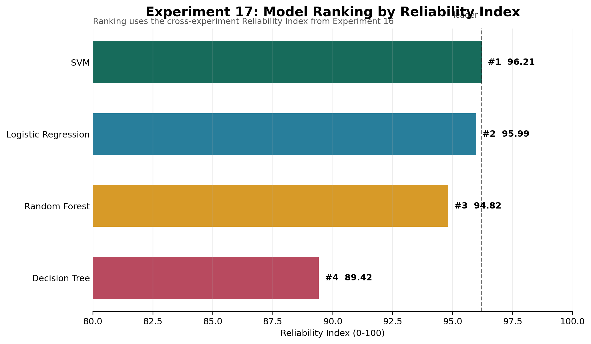
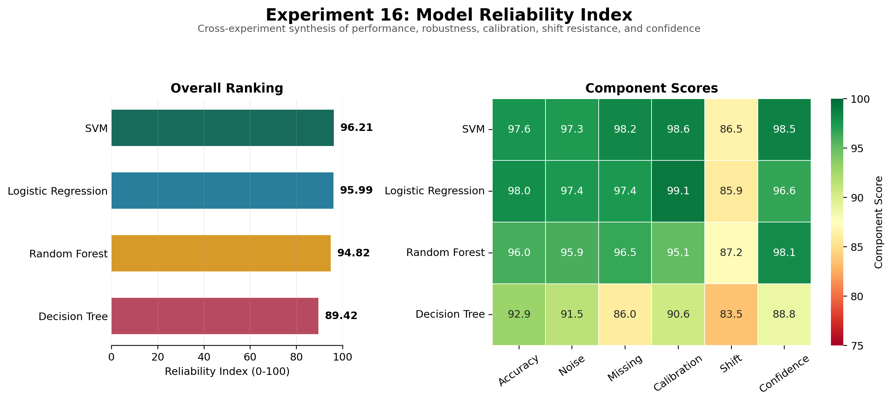

# When Systems Break

**An experimental framework for measuring machine learning reliability under noise, missing data, feature degradation, distribution shift, confidence collapse, and refusal-based decision-making.**

[Research Report](paper/when-systems-break.pdf) | [Interactive Demo](app.py) | [Experiments](experiments) | [Blogs](blogs)



## Experiment 17 - Model Ranking

Experiment 17 ranks all models using the Reliability Index from Experiment 16. This gives the project a clear answer to the question: which model is strongest overall once accuracy, robustness, calibration, distribution shift, and confidence behavior are considered together?

| Rank | Model | Reliability Index | Gap to Leader | Tier |
|---:|---|---:|---:|---|
| 1 | SVM | **96.21** | 0.00 | Leader |
| 2 | Logistic Regression | **95.99** | 0.22 | Leader |
| 3 | Random Forest | **94.82** | 1.39 | Competitive |
| 4 | Decision Tree | **89.42** | 6.79 | Needs Review |

The ranking shows why reliability is more useful than a single clean accuracy score. SVM ranks first overall, Logistic Regression is nearly tied, Random Forest remains competitive, and Decision Tree needs review despite respectable clean-data accuracy.

## Experiment 16 - Reliability Index



Reliability is multi-dimensional. Experiment 16 combines accuracy, noise robustness, missing-data performance, calibration, distribution-shift resistance, and confidence behavior into one cross-experiment index.

| Model | Reliability Index |
|---|---:|
| SVM | **96.21** |
| Logistic Regression | **95.99** |
| Random Forest | **94.82** |
| Decision Tree | **89.42** |

```text
Reliability = 0.25(Accuracy)
            + 0.20(Noise Robustness)
            + 0.15(Missing Data)
            + 0.15(Calibration)
            + 0.15(Distribution Shift)
            + 0.10(Confidence)
```

Every component remains visible in the figure and CSV. The index ranks models within this repository; it is not a universal safety certification.

## Experiment 14 - Model Reliability Score


A single accuracy value hides how a model behaves when conditions change. Experiment 14 introduces a transparent composite score built from five measured components.

| Model | Reliability Score | Clean Accuracy | Robustness | Confidence Stability | Refusal Quality | Repeatability |
|---|---:|---:|---:|---:|---:|---:|
| Logistic Regression | **94.64** | 97.98 | 99.06 | 98.97 | 91.68 | 72.95 |
| SVM | **94.08** | 97.60 | 99.26 | 98.78 | 91.26 | 69.13 |
| Random Forest | **92.46** | 95.99 | 99.51 | 94.28 | 89.86 | 66.69 |
| Decision Tree | **77.46** | 92.92 | 95.76 | 89.97 | 50.00 | 21.47 |

The proposed score weights clean accuracy (30%), robustness (25%), confidence stability (15%), refusal quality (20%), and repeatability (10%). It is an experimental comparison framework, not a universal or externally validated safety score.

---

## Why This Project Exists

Most machine learning projects report a single clean-data accuracy score.

Real systems are messier. Inputs become noisy, features disappear, missing values appear, and models can stay confident even when they are wrong.

This project studies what happens when those assumptions break.

The goal is not only to build a model. The goal is to understand how models fail, how early those failures can be detected, and when a system should stop trusting its own predictions.

---

## Research Questions

1. How does increasing noise affect model accuracy?
2. Which features contribute most to model stability?
3. Do different algorithms fail differently?
4. Can confidence scores warn us before accuracy collapses?
5. Is missing information more harmful than noisy information?
6. When should a model refuse to make a prediction?
7. Can multiple reliability signals be combined without hiding their tradeoffs?
8. Does 90% confidence actually correspond to 90% correctness?
9. Can a system detect when the deployment distribution has changed?
10. Which model is most reliable when all reliability dimensions are ranked together?

---

## Project Highlights

- Controlled robustness experiments across noise, missing data, and feature removal
- Multi-model comparison using Logistic Regression, Decision Tree, Random Forest, and SVM
- Multi-run statistical analysis across 30 random seeds
- Failure matrix heatmap for model-by-condition comparison
- Confidence collapse study using `predict_proba()`
- Calibration analysis with Expected Calibration Error and reliability diagrams
- Distribution-shift monitoring with domain-classifier AUC and Population Stability Index
- Refusal-threshold analysis for safer model behavior
- Proposed five-component Model Reliability Score across 30 seeded runs
- Reliability-based model ranking with leader gap and review tiers
- Streamlit research dashboard with experiment navigation, metric cards, figures, and an interactive failure lab
- Research-style paper with generated figures and PDF export

---

## Key Outputs

| Output | File |
|---|---|
| Research paper | [paper/when-systems-break.pdf](paper/when-systems-break.pdf) |
| Failure matrix heatmap | [figures/failure_matrix.png](figures/failure_matrix.png) |
| Confidence collapse plot | [figures/confidence_collapse.png](figures/confidence_collapse.png) |
| Accuracy vs coverage plot | [figures/accuracy_vs_coverage.png](figures/accuracy_vs_coverage.png) |
| Reliability score plot | [figures/reliability_scores.png](figures/reliability_scores.png) |
| Reliability score CSV | [results/reliability_scores.csv](results/reliability_scores.csv) |
| Reliability run-level audit data | [results/reliability_run_metrics.csv](results/reliability_run_metrics.csv) |
| Calibration curve | [figures/calibration_curve.png](figures/calibration_curve.png) |
| Reliability diagram | [figures/reliability_diagram.png](figures/reliability_diagram.png) |
| Calibration metrics | [results/calibration_metrics.csv](results/calibration_metrics.csv) |
| Distribution-shift study | [figures/distribution_shift.png](figures/distribution_shift.png) |
| Distribution-shift statistics | [results/shift_statistics.csv](results/shift_statistics.csv) |
| Reliability Index figure | [figures/reliability_index.png](figures/reliability_index.png) |
| Reliability Index CSV | [results/reliability_index.csv](results/reliability_index.csv) |
| Model ranking figure | [figures/model_ranking.png](figures/model_ranking.png) |
| Model ranking CSV | [results/model_ranking.csv](results/model_ranking.csv) |
| Statistical robustness CSV | [results/model_statistics.csv](results/model_statistics.csv) |
| Failure matrix CSV | [results/failure_matrix.csv](results/failure_matrix.csv) |
| Confidence collapse CSV | [results/confidence_collapse.csv](results/confidence_collapse.csv) |
| Refusal statistics CSV | [results/refusal_statistics.csv](results/refusal_statistics.csv) |

---

## Experiments

| # | Experiment | File | Purpose |
|---:|---|---|---|
| 01 | Baseline noise injection | [experiment1.py](experiments/experiment1.py) | Compare clean performance with noisy-input performance |
| 02 | Missing data simulation | [experiment2.py](experiments/experiment2.py) | Test how incomplete inputs affect predictions |
| 03 | Feature importance | [experiment3.py](experiments/experiment3.py) | Identify which features influence the model most |
| 04 | Model comparison | [experiment4_model_comparison.py](experiments/experiment4_model_comparison.py) | Compare algorithms under clean, noisy, and missing inputs |
| 05 | Feature removal | [experiment5_feature_removal.py](experiments/experiment5_feature_removal.py) | Measure degradation after removing important features |
| 06 | Noise robustness curve | [experiment6_noise_curve.py](experiments/experiment6_noise_curve.py) | Track accuracy as noise increases |
| 07 | Threshold analysis | [experiment7_threshold_analysis.py](experiments/experiment7_threshold_analysis.py) | Find reliability thresholds under stronger perturbation |
| 08 | Failure comparison | [experiment8_comparison.py](experiments/experiment8_comparison.py) | Compare failure conditions in one degradation curve |
| 09 | Multi-run statistics | [experiment9_multi_run_analysis.py](experiments/experiment9_multi_run_analysis.py) | Estimate mean and variance across 30 random seeds |
| 10 | Failure matrix dashboard | [experiment10_failure_matrix.py](experiments/experiment10_failure_matrix.py) | Generate the model-by-condition heatmap |
| 11 | Confidence collapse | [experiment11_confidence_collapse.py](experiments/experiment11_confidence_collapse.py) | Track confidence decline and wrong predictions under noise |
| 12 | Refusal system | [experiment12_refusal_system.py](experiments/experiment12_refusal_system.py) | Measure accuracy, coverage, and refusal rate across confidence thresholds |
| 13 | Calibration analysis | [experiment13_calibration.py](experiments/experiment13_calibration.py) | Test whether predicted confidence matches observed correctness |
| 14 | Reliability score framework | [experiment14_reliability_score.py](experiments/experiment14_reliability_score.py) | Combine accuracy, robustness, confidence, refusal quality, and variance |
| 15 | Distribution shift | [experiment15_distribution_shift.py](experiments/experiment15_distribution_shift.py) | Measure performance loss and detect train-to-test covariate shift |
| 16 | Reliability Index | [experiment16_reliability_index.py](experiments/experiment16_reliability_index.py) | Combine six cross-experiment reliability dimensions into one ranking |
| 17 | Model ranking | [experiment17_model_ranking.py](experiments/experiment17_model_ranking.py) | Rank all models by Reliability Index with leader gap and tier labels |

---

## Blogs

| # | Article |
|---:|---|
| 01 | [What happens when data breaks?](blogs/01-what-happens-when-data-breaks.md) |
| 02 | [What happens when data is missing?](blogs/02-when-data-is-missing.md) |
| 03 | [Which features actually matter?](blogs/03-which-features-matter.md) |
| 04 | [Final insights](blogs/04-final-insights.md) |
| 05 | [Do different models break differently?](blogs/05-model-comparison.md) |
| 06 | [What happens when important features disappear?](blogs/06-when-important-features-break.md) |
| 07 | [When models become overconfident](blogs/07-model-confidence-under-noise.md) |
| 08 | [How robust is a model to increasing noise?](blogs/08-robustness-under-noise.md) |
| 09 | [Failure taxonomy](blogs/09-failure-taxonomy.md) |
| 10 | [Comparing failure patterns](blogs/10-comparing-failure-patterns.md) |
| 11 | [Why one accuracy score is not enough](blogs/11-statistical-robustness.md) |
| 12 | [When models become confidently wrong](blogs/12-confidence-collapse.md) |
| 13 | [When should a model say "I don't know"?](blogs/13-when-should-a-model-refuse.md) |
| 14 | [Beyond accuracy: a reliability score for machine learning](blogs/14-model-reliability-score.md) |
| 15 | [Does 90% confidence mean 90% correct?](blogs/15-confidence-calibration.md) |
| 16 | [What makes a model reliable?](blogs/16-what-makes-a-model-reliable.md) |
| 17 | [Which model is the most reliable?](blogs/17-which-model-is-the-most-reliable.md) |
| 18 | [When the world changes](blogs/18-when-the-world-changes.md) |

---

## Research Dashboard

Run the Streamlit app:

```bash
streamlit run app.py
```

The dashboard includes:

- Landing page
- Overview
- Experiments
- Dataset Explorer
- Failure Matrix
- Calibration
- Confidence Collapse
- Distribution Shift
- Reliability Ranking
- Model Explorer
- Research Progress
- About the Research
- Downloads
- Interactive Failure Lab

The interactive lab lets a user upload data, inject noise, remove features, create missing values, and inspect prediction, confidence, failure risk, and the model Reliability Index.

---

## Reproduce Results

Install dependencies:

```bash
pip install -r requirements.txt
```

Run the newest research experiments:

```bash
python experiments/experiment9_multi_run_analysis.py
python experiments/experiment10_failure_matrix.py
python experiments/experiment11_confidence_collapse.py
python experiments/experiment12_refusal_system.py
python experiments/experiment13_calibration.py
python experiments/experiment14_reliability_score.py
python experiments/experiment15_distribution_shift.py
python experiments/experiment16_reliability_index.py
python experiments/experiment17_model_ranking.py
```

---

## Repository Structure

```text
when-systems-break/
|-- app.py
|-- README.md
|-- requirements.txt
|-- blogs/
|-- data/
|-- dashboard/
|-- docs/
|-- experiments/
|-- figures/
|-- notebooks/
|-- results/
`-- paper/
```

---

## Tech Stack

- Python
- NumPy
- Pandas
- Scikit-learn
- Matplotlib
- Seaborn
- Streamlit

---

## Citation

Citation metadata is available in [CITATION.cff](CITATION.cff). GitHub will show a **Cite this repository** button from this file.

---

## Core Insight

Machine learning systems often fail gradually before they fail obviously.

By studying noise, missing information, feature degradation, statistical variance, confidence collapse, refusal thresholds, distribution shift, and reliability ranking, this project shows why reliability must be measured as a system property rather than reduced to one clean-data score.
