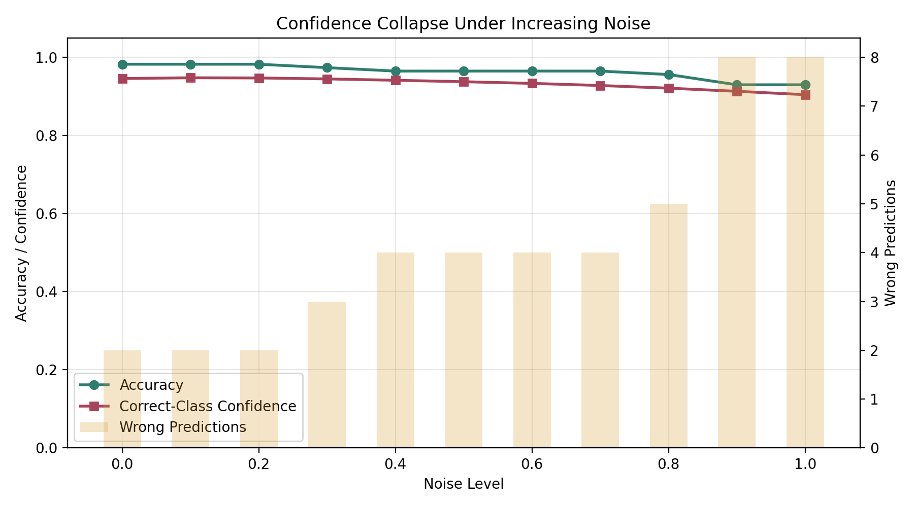
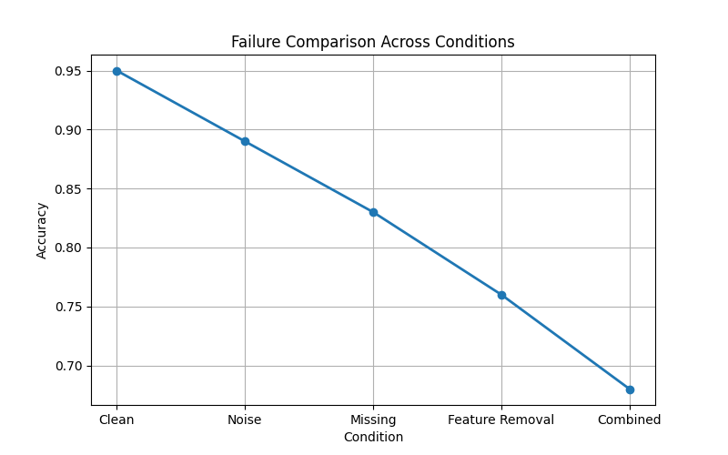

# when-systems-break

📄 Research Report:
[paper/when-systems-break.pdf](paper/when-systems-break.pdf)

A research-style project exploring how machine learning systems behave under real-world imperfect data conditions.


---

## Overview

Real-world data is rarely clean or complete.

This project focuses on understanding how machine learning models behave when:
- data is noisy  
- data is missing  
- important features are removed  
- conditions change gradually  

The goal is not just to optimize accuracy, but to **study how systems respond when things go wrong**.

---

## Blogs

- [What happens when data breaks?](blogs/01-what-happens-when-data-breaks.md)
- [What happens when data is missing?](blogs/02-when-data-is-missing.md)
- [Which features actually matter?](blogs/03-which-features-matter.md)
- [Final insights](blogs/04-final-insights.md)
- [Do different models break differently?](blogs/05-model-comparison.md)
- [What happens when important features disappear?](blogs/06-when-important-features-break.md)
- [When models become overconfident](blogs/07-model-confidence-under-noise.md)
- [How robust is a model to increasing noise?](blogs/08-robustness-under-noise.md)
- [Failure taxonomy](blogs/09-failure-taxonomy.md)
- [Comparing failure patterns](blogs/10-comparing-failure-patterns.md)
- [Why one accuracy score is not enough](blogs/11-statistical-robustness.md)
- [When models become confidently wrong](blogs/12-confidence-collapse.md)

---

## Experiments

1. **Noise Injection**  
   Introduced randomness to observe impact on accuracy  

2. **Missing Data Simulation**  
   Tested how incomplete inputs affect model performance  

3. **Feature Importance Analysis**  
   Identified which features influence predictions most  

4. **Model Comparison**  
   Compared how different models respond to imperfect data  

5. **Feature Removal Sensitivity**  
   Removed key features to observe system degradation  

6. **Robustness Curve**  
   Measured how accuracy changes as noise increases  

7. **Multi-Run Statistical Robustness**  
   Repeated model evaluation across 30 random seeds to measure mean accuracy and variance  

8. **Failure Matrix Dashboard**  
   Compared clean, noisy, missing-data, and feature-removal performance across models  

9. **Confidence Collapse Study**  
   Measured how predicted probabilities change as noise increases and mistakes become more frequent  

---

## Interactive Demo

Run the Streamlit demo:

```bash
streamlit run app.py
```

The demo supports uploaded data, noise injection, feature removal, missing-data creation, prediction, confidence, and failure-risk scoring.

---

## Key Insights

- Not all imperfections affect systems equally  
- Removing critical features causes sharper failure than random noise  
- Models can appear stable while becoming internally unreliable  
- Performance degradation is gradual, not always immediate  

---

## Visualizations

### Feature Importance


### Noise vs Accuracy


### Failure Matrix


### Confidence Collapse


## Failure Comparison



---

## Tech Stack

- Python  
- NumPy, Pandas  
- Scikit-learn  
- Matplotlib  

---

## Goal

To move beyond “building models” and toward **understanding how systems behave when things go wrong**.
