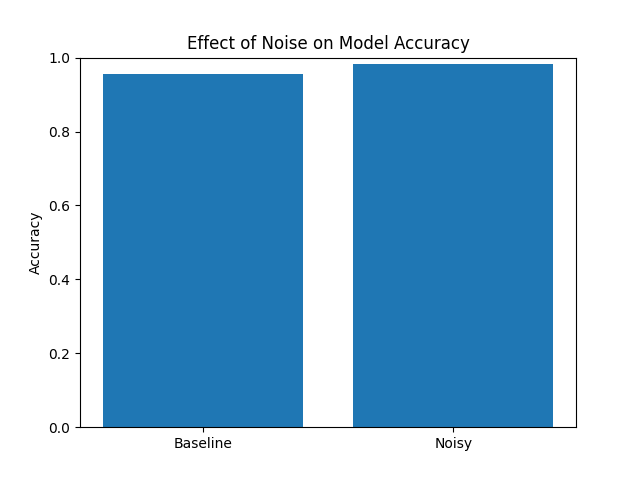

# What happens when data breaks?

## Problem
In real-world systems, data is rarely perfect.  
There can be noise, missing values, or inconsistencies.

I wanted to understand:
What actually happens to a machine learning model when the data it receives is slightly degraded?

---

## Approach
I started with a clean dataset and trained a simple Logistic Regression model to establish a baseline.

Then, I introduced controlled noise into the test data by adding random values to simulate imperfect real-world conditions.

The goal was not to improve performance, but to observe how the model behaves when data quality drops.

---

## Experiment Setup
- Dataset: Breast Cancer dataset (from scikit-learn)
- Model: Logistic Regression
- Evaluation: Accuracy score
- Noise: Gaussian noise added to input features

---

## Observations (experiment)

- Baseline accuracy: ~0.95  
- After adding noise: ~0.82  
- Drop in accuracy: ~0.13  

Even moderate noise led to a clear performance drop.

More interestingly, the model did not fail suddenly.  
The degradation was gradual, which makes it harder to detect in real systems.

---

## Insight
Models are more sensitive to data quality than they appear.

What stood out was:
The model didn’t “break” — it slowly became unreliable.

This kind of silent degradation is dangerous because:
- there is no obvious failure signal  
- predictions continue, but with reduced trust  

---

## Why this matters
In production systems, we often assume models are working fine if they don’t crash.

But degraded input can lead to unreliable outputs without obvious warning.

Understanding how models behave under imperfect conditions is essential for building systems we can trust.

---

## Visualization

---

## Next
- Test the impact of missing data  
- Identify which features are most sensitive  
- Explore ways to detect silent model failure  
