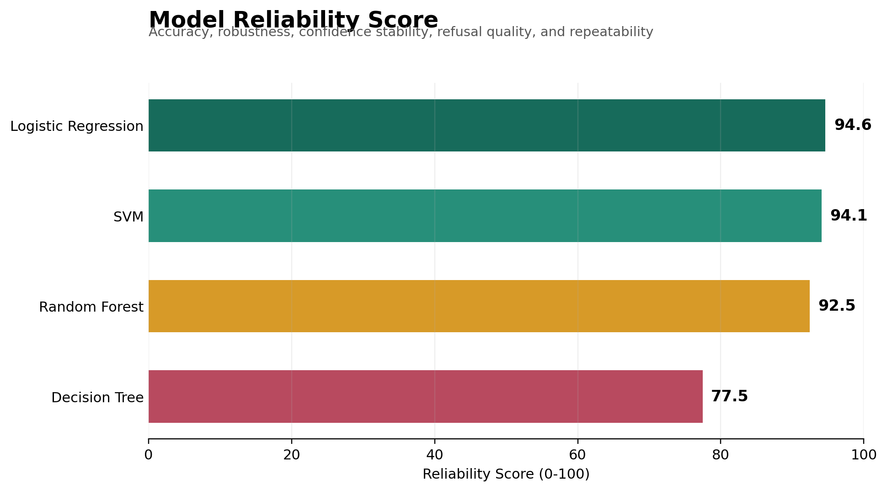

# Beyond Accuracy: A Reliability Score for Machine Learning

An accuracy of 96% sounds precise. It does not tell us whether the model survives noisy inputs, varies across training runs, knows when it is likely to be wrong, or can refuse unsafe predictions.

Experiment 13 proposes a **Model Reliability Score** that combines these behaviors without hiding the underlying measurements.

## The Framework

The score has five components, each measured on a 0–100 scale:

| Component | Weight | Question |
|---|---:|---|
| Accuracy | 30% | How often is the model correct on clean data? |
| Robustness | 25% | How much performance survives degradation? |
| Confidence Stability | 15% | Does confidence remain aligned with observed accuracy? |
| Refusal Quality | 20% | Can confidence distinguish correct from incorrect predictions? |
| Repeatability | 10% | Does performance remain stable across random seeds? |

```text
Reliability = 0.30(Accuracy)
            + 0.25(Robustness)
            + 0.15(Confidence Stability)
            + 0.20(Refusal Quality)
            + 0.10(Repeatability)
```

The weights reflect this project's priorities: predictive performance matters, but reliability under degradation and the ability to identify risky predictions together matter more.

## Results



| Model | Reliability Score |
|---|---:|
| Logistic Regression | 94.64 |
| SVM | 94.08 |
| Random Forest | 92.46 |
| Decision Tree | 77.46 |

The ranking reveals information that clean accuracy alone misses. The Decision Tree achieves a clean accuracy score of 92.92, but its repeatability score is only 21.47. Its confidence also cannot rank correct predictions above errors, producing a refusal-quality score of 50.00, equivalent to random discrimination.

Logistic Regression ranks first because it combines strong clean performance with stable degradation behavior and useful confidence estimates. SVM remains close across accuracy, robustness, and confidence stability, but its lower repeatability keeps it just behind Logistic Regression.

## Why Refusal Quality Uses ROC AUC

A refusal policy needs confidence to order predictions by risk. If correct predictions generally receive higher confidence than incorrect ones, increasing the refusal threshold can remove risky cases first. ROC AUC measures this ranking ability without fixing one operating threshold.

This is stronger than rewarding a model merely for refusing many predictions. A model receives a high refusal-quality score only when its confidence is informative about correctness.

## What the Score Does Not Mean

The Model Reliability Score is a proposed benchmark metric, not a certified safety rating. Its value depends on the dataset, degradation conditions, component definitions, and weights. A score of 94 does not mean a model is 94% safe in deployment.

The responsible use of a composite metric is to keep every component visible. The final number helps rank models; the component scores explain why that ranking occurred.

## The Shift

The project no longer asks only, "Which model is most accurate?"

It asks a more operational question: **Which model remains dependable when its inputs, confidence, and training conditions stop being ideal?**
