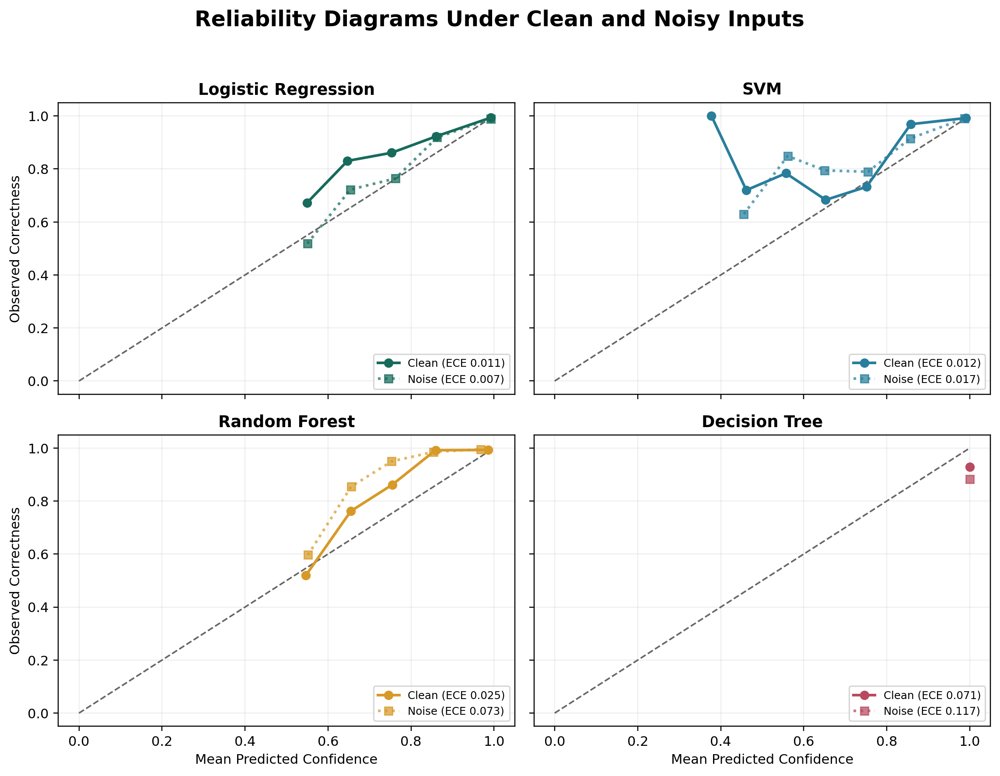

# Does 90% Confidence Mean 90% Correct?

Prediction confidence is easy to display and easy to misunderstand. A model that reports 90% confidence is calibrated only if predictions made at that confidence level are correct about 90% of the time.

Experiment 13 tests this relationship across Logistic Regression, SVM, Random Forest, and Decision Tree models. It pools predictions from 30 seeded train-test splits and evaluates both clean and noisy inputs.

## Expected Calibration Error

Predictions are divided into ten equal-width confidence bins. For each bin, the experiment compares mean predicted confidence with observed correctness.

```text
ECE = sum((bin count / total count) * abs(bin accuracy - bin confidence))
```

Expected Calibration Error, or ECE, is the sample-weighted average of those gaps. Lower values indicate closer agreement between what the model claims and what actually happens.

## Results

| Model | Clean ECE | Noise ECE | 90-100% Clean Bin Accuracy | 90-100% Noise Bin Accuracy |
|---|---:|---:|---:|---:|
| Logistic Regression | 1.13% | 0.71% | 99.36% | 98.92% |
| SVM | 1.22% | 1.66% | 99.22% | 99.05% |
| Random Forest | 2.53% | 7.30% | 99.27% | 99.52% |
| Decision Tree | 7.08% | 11.73% | 92.92% | 88.27% |


Logistic Regression and SVM are closely calibrated in this experiment. Their mean confidence and observed correctness remain similar across the pooled predictions.

Random Forest remains accurate under noise, but its confidence becomes conservative. This produces a larger calibration gap even though classification accuracy stays high. Calibration error therefore does not always mean overconfidence; underconfidence is also miscalibration.

The Decision Tree shows the clearest failure. Its predictions carry 100% confidence, while clean correctness is 92.92% and noisy correctness falls to 88.27%. It cannot express uncertainty between those outcomes.

## Reliability Diagram



Points on the diagonal are calibrated: confidence matches correctness. Points above the diagonal are underconfident, while points below it are overconfident. The diagrams expose patterns that a single ECE number can hide.

## Important Limitation

ECE depends on bin boundaries, the number of bins, and the available sample size. This experiment uses ten equal-width bins and reports the complete bin-level data in `calibration_bins.csv`. The metric supports comparison within this benchmark; it is not a universal certificate of trustworthy probability estimates.

## Answer

Does 90% confidence mean 90% correctness?

Sometimes. Logistic Regression and SVM come close in this controlled experiment. The Decision Tree demonstrates why confidence must be validated rather than believed: a model can be completely certain and still be wrong much more often than its probabilities imply.
