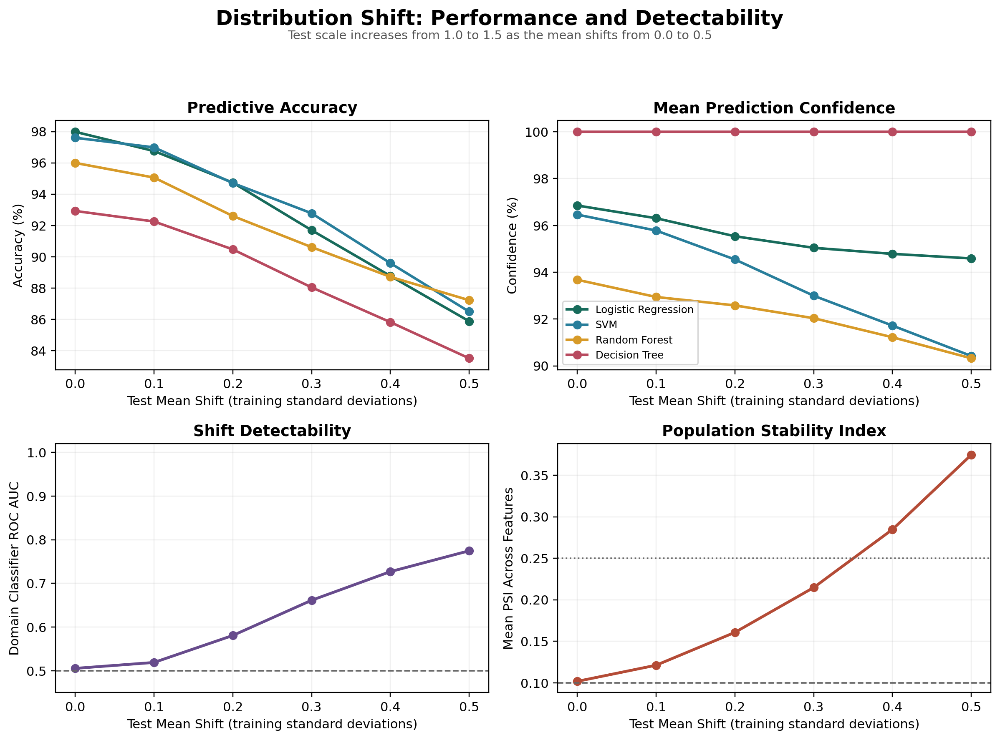

# When the World Changes

Noise experiments damage individual values. Distribution shift asks a different question: what happens when the population producing those values changes?

A model may be trained on one hospital, device, region, or time period and deployed in another. Every input can remain technically valid while the relationships learned during training become less useful.

## Experiment 15

The test features are transformed in training-standardized space:

```text
z_shifted = mean_shift + std_multiplier * z_test
```

The experiment moves through six levels from an unchanged test distribution to a mean shift of 0.5 training standard deviations and a scale multiplier of 1.5. Every level is evaluated across 30 seeded splits and four model families.



## Performance at the Largest Shift

| Model | Accuracy | Accuracy Drop | Mean Confidence |
|---|---:|---:|---:|
| Random Forest | 87.22% | 8.77 points | 90.32% |
| SVM | 86.49% | 11.11 points | 90.42% |
| Logistic Regression | 85.88% | 12.11 points | 94.59% |
| Decision Tree | 83.51% | 9.42 points | 100.00% |

Every model loses substantial accuracy. Confidence does not necessarily fall at the same rate. Logistic Regression remains 94.59% confident while accuracy declines to 85.88%, and the Decision Tree remains completely confident throughout the shift.

## Can the Change Be Detected?

The experiment measures two external drift signals.

**Domain-classifier ROC AUC** asks whether a separate model can distinguish training samples from deployment samples. The mean AUC begins at 0.506 under no imposed shift and rises to 0.775 at the largest shift.

**Population Stability Index** compares feature-frequency distributions using training-quantile bins. Mean PSI rises from 0.102 for the finite unshifted holdout to 0.375 at the largest shift.

Both signals increase before the final performance collapse. This means the changed environment is statistically detectable even when the prediction model itself remains confident.

## The Monitoring Lesson

Prediction confidence answers, "How strongly does the model prefer this output?"

Drift detection answers, "Does this input population resemble the world used to build the model?"

Those are different questions. A production reliability system needs both.

## Limitations

This is controlled affine covariate shift, not a complete model of real deployment drift. PSI is sensitive to binning and sample size, while domain-classifier AUC depends on detector design. The unshifted baseline is not exactly zero because training and holdout data are finite samples.

The meaningful signal is therefore the change relative to a calibrated baseline, not a universal threshold copied across applications.
