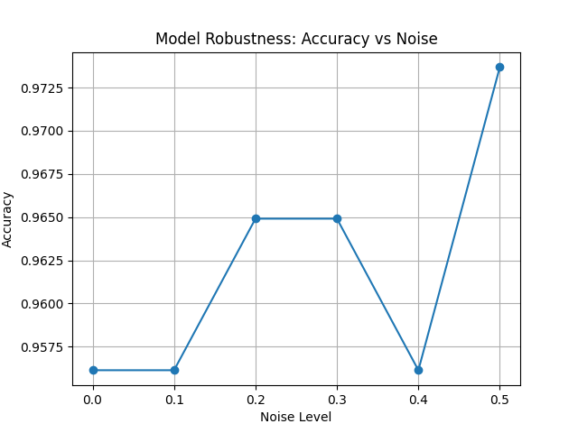
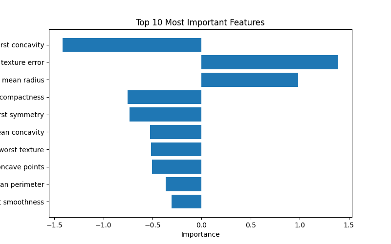
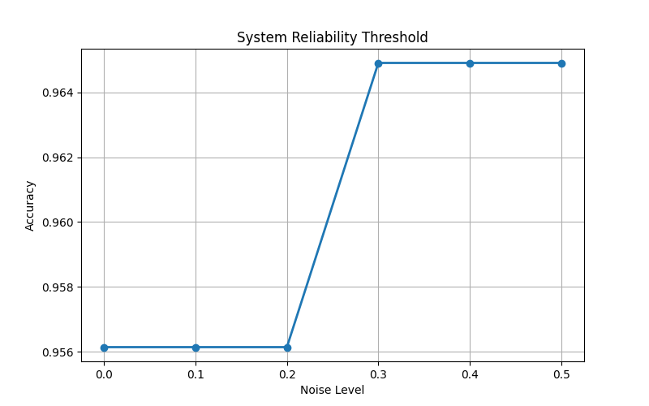

# When Systems Break:
# Understanding Model Failure Under Noise, Missing Data, and Feature Degradation

## 1. Abstract

Machine learning models often achieve high performance under ideal conditions but can behave unpredictably when data quality deteriorates. This project investigates how machine learning models respond to noise, missing information, and feature degradation. Through a series of controlled experiments, models were evaluated under progressively challenging conditions to identify failure patterns, robustness thresholds, and changes in predictive behavior.

The experiments examine baseline performance, missing-data behavior, injected noise, feature importance, feature removal, threshold effects, and comparative failure patterns. Results show that model performance degrades non-linearly as data quality decreases. Certain features contribute disproportionately to model stability, while accuracy can remain relatively stable at low noise levels before declining more sharply as degradation increases.

These findings highlight the importance of robustness testing and explainability when deploying machine learning systems in real-world environments. Understanding how models behave under imperfect conditions provides a clearer view of failure risk than clean-data accuracy alone.

## 2. Introduction

Most machine learning projects focus on improving accuracy.

However, real-world systems rarely operate under ideal conditions. Data can be noisy, incomplete, corrupted, or significantly different from the distribution seen during training.

This raises an important question:

What happens when the assumptions behind a machine learning model begin to fail?

The objective of this project is to systematically explore how machine learning systems behave under various forms of information degradation and identify patterns that emerge before complete failure occurs.

## 3. Research Questions

**RQ1:** How does increasing noise affect model accuracy?

**RQ2:** Which features contribute most to model performance?

**RQ3:** Do different algorithms fail differently?

**RQ4:** Can confidence scores indicate failure before accuracy drops?

**RQ5:** Is missing information more harmful than noisy information?

## 4. Methodology

Eight controlled experiments were conducted.

**Experiment 1:** Baseline model training and evaluation.

**Experiment 2:** Performance under missing data.

**Experiment 3:** Feature importance analysis.

**Experiment 4:** Comparison of multiple machine learning models.

**Experiment 5:** Feature removal analysis.

**Experiment 6:** Noise threshold analysis.

**Experiment 7:** Confidence degradation and reliability threshold analysis.

**Experiment 8:** Comparative failure pattern evaluation.

## 5. Experimental Setup

**Language:** Python

**Libraries:**

- Pandas
- NumPy
- Scikit-Learn
- Matplotlib

**Models:**

- Logistic Regression
- Random Forest

**Evaluation Metrics:**

- Accuracy
- Confidence and reliability behavior
- Feature importance

## 6. Results

### Result 1: Effect of Noise

Accuracy decreases as noise increases. The decline remains gradual initially but accelerates beyond a critical threshold, showing that failure is not always immediate.

### Result 2: Feature Importance

A small subset of features contributes disproportionately to model performance. This suggests that degradation in highly influential features can be more damaging than random degradation across all features.

### Result 3: Threshold Analysis

Threshold analysis shows how reliability changes as noise becomes stronger. The model remains relatively stable at lower noise levels, then becomes more vulnerable as the perturbation increases.

### Result 4: Model Comparison

The comparison highlights that different failure conditions do not produce identical effects. Clean data, noisy data, missing values, feature removal, and combined degradation create distinct performance patterns.

## 7. Key Findings

1. Noise does not cause immediate failure.

2. Performance degradation occurs gradually before collapse.

3. Some features have significantly greater influence than others.

4. Different models and degradation conditions exhibit different robustness characteristics.

5. Confidence and reliability behavior may serve as early warning signals.

## 8. Limitations

The experiments were performed on a limited dataset and in a controlled environment. While this makes the failure patterns easier to isolate, it does not fully capture the complexity of production machine learning systems.

Future studies should investigate larger datasets, distribution shifts, adversarial perturbations, and real-world deployment scenarios.

## 9. Future Work

Future work includes:

- Explainable AI using SHAP
- Semantic noise analysis
- Distribution shift experiments
- Human-in-the-loop evaluation
- Interactive robustness dashboard

## 10. Conclusion

This project demonstrates that machine learning systems often fail gradually rather than abruptly.

By studying noise, missing information, and feature degradation, it becomes possible to identify early warning signs of failure and better understand model robustness.

Understanding how systems break may ultimately be as important as understanding how they succeed.
