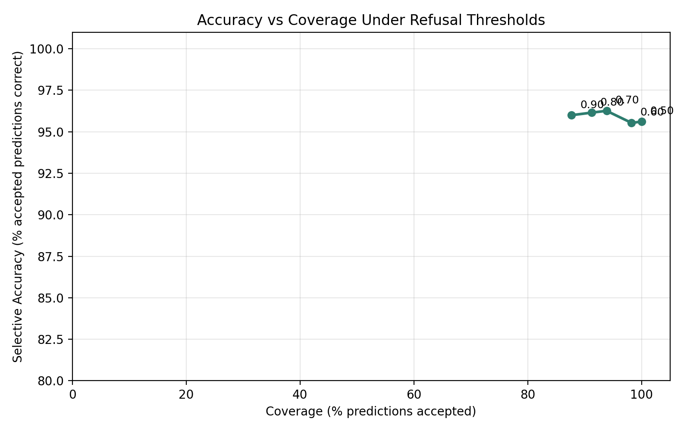
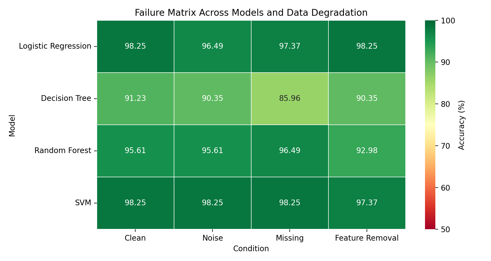
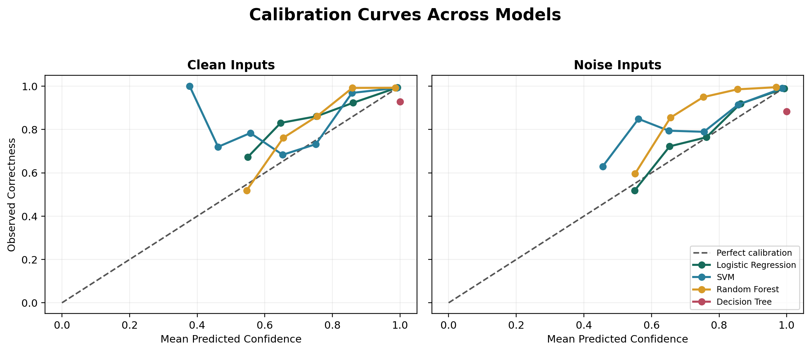

# When Systems Break:
# Understanding Model Failure Under Noise, Missing Data, Feature Degradation, and Refusal Thresholds

## 1. Abstract

Machine learning systems are commonly evaluated using clean-data accuracy, but deployed models often operate under degraded input conditions. Data can become noisy, incomplete, corrupted, or partially unavailable, causing models to behave differently from their reported benchmark performance. This paper studies how supervised learning models respond when the assumptions behind their inputs begin to fail.

Using a controlled tabular classification setting, sixteen experiments evaluate model behavior under noise injection, missing values, feature removal, repeated random seeds, distribution shift, confidence degradation, calibration, and refusal thresholds. The results show that model failure is often gradual rather than immediate. Accuracy can remain stable at low degradation levels before declining more sharply, and different algorithms exhibit different robustness patterns. Confidence scores also provide useful signals, but they must be interpreted alongside drift detection, calibration, coverage, and refusal rate.

The central finding is that robustness evaluation should not stop at measuring failure. A stronger system should detect uncertainty and respond to it. Refusal-based reliability provides one such response by allowing a model to abstain from low-confidence predictions. A proposed Model Reliability Score evaluates five behaviors in one benchmark, while a cross-experiment Reliability Index synthesizes accuracy, robustness, calibration, shift resistance, and confidence without hiding its component evidence.

## 2. Introduction

Most machine learning projects emphasize improving accuracy under ideal conditions. This is useful, but it is incomplete. Real-world systems rarely receive perfectly clean inputs. Features may be missing, sensors may produce noise, users may enter unusual values, and deployment data may differ from training data.

This raises a practical reliability question:

What happens when a machine learning system is asked to make predictions under degraded information?

The goal of this project is to study model failure as a measurable process. Instead of treating failure as a single event, the experiments examine how performance changes as input quality declines. The project also studies whether confidence scores can help identify risky predictions before the system fails visibly.

The later experiments ask whether stated confidence matches empirical correctness, whether a changed deployment distribution can be detected, and whether separate reliability signals can be summarized in a transparent composite score without reducing reliability back to accuracy alone.

The research story progresses through three stages:

1. Models fail under degraded information.

2. Some failures can be detected through accuracy, confidence, and variance.

3. Systems can respond by refusing predictions when reliability is too low.

4. Reliability evidence can be combined while preserving the underlying measurements.

## 3. Experimental Setup

All experiments were implemented in Python using a controlled classification workflow.

**Language:** Python

**Libraries:**

- NumPy
- Pandas
- Scikit-learn
- Matplotlib
- Seaborn

**Models:**

- Logistic Regression
- Decision Tree
- Random Forest
- Support Vector Machine

**Evaluation Metrics:**

- Accuracy
- Mean accuracy across repeated runs
- Standard deviation across repeated runs
- Prediction confidence using `predict_proba()`
- Coverage
- Refusal rate
- Feature importance
- Model Reliability Score
- Reliability Index
- Expected Calibration Error
- Domain-classifier ROC AUC
- Population Stability Index

The experiments use clean data as a baseline and then introduce controlled degradation through noise injection, missing values, feature removal, and confidence thresholds. Later experiments compare multiple models and summarize failure patterns in aggregate visualizations.

## 4. Noise Analysis

Noise analysis evaluates how model accuracy changes when random perturbations are added to the input features. This simulates real-world situations where measurements are imprecise, corrupted, or affected by environmental variation.


The noise curve shows that degradation is not always immediate. At lower noise levels, the model may continue to perform well. As noise increases, accuracy begins to decline more noticeably. This suggests that model failure can be non-linear: systems may appear stable until a reliability threshold is crossed.

Threshold analysis provides a second view of this behavior.


Together, these results show why robustness testing should evaluate performance across multiple degradation levels rather than relying on a single noisy condition.

## 5. Missing Data Analysis

Missing data analysis studies how the system behaves when part of the input information is unavailable. In real deployments, missing values can come from incomplete forms, sensor failures, data pipeline issues, or unavailable external signals.

Missing information differs from random noise. Noise distorts existing information, while missingness removes information entirely. This can be more harmful when the missing features are important for prediction.

The project also studies feature importance to identify which inputs contribute most strongly to model behavior.


The feature-importance results show that not all features contribute equally. A small subset of features has a larger effect on model predictions. This means that removing or corrupting important features can produce sharper performance drops than degrading less influential features.

## 6. Confidence Collapse

Confidence collapse asks whether a model becomes less certain as inputs become less reliable.

The experiment uses `predict_proba()` to track three signals as noise increases:

- accuracy
- confidence in the correct class
- number of wrong predictions


The results show that wrong predictions become more frequent as noise increases. Confidence in the correct class also declines, but the model can still assign high confidence to some incorrect predictions. This is an important reliability risk: a wrong but uncertain model is easier to manage than a wrong and confident one.

Confidence scores are therefore useful, but they should not be treated as perfect guarantees. They are signals that can support reliability decisions, especially when combined with degradation tests and refusal thresholds.

## 7. Refusal-Based Reliability

Refusal-based reliability addresses the question:

When should a machine learning system stop trusting itself?

Standard classifiers usually predict every time:

```text
prediction = model.predict(X)
confidence = max(model.predict_proba(X))
```

A refusal-aware system adds a safety rule:

```text
if confidence < threshold:
    prediction = "REFUSE"
```

This creates a tradeoff between accuracy and coverage. Coverage measures how often the model is willing to make a prediction. Accuracy measures how often accepted predictions are correct. As the confidence threshold increases, the model refuses more low-confidence examples. This can improve the quality of accepted predictions while reducing how often the system answers.



The refusal experiment evaluates thresholds from 0.50 to 0.90 and stores threshold, coverage, accuracy, refusal rate, accepted predictions, and refused predictions. This turns robustness analysis into a practical system-design question: should the model answer, or should it defer?

## 8. Failure Matrix

The failure matrix compares multiple models across multiple degradation conditions in one visualization. It evaluates clean inputs, noisy inputs, missing data, and feature-removal conditions.



The matrix shows that failure behavior is not uniform. Some models remain more stable under noise, while others are more affected by missing data or feature removal. This supports the idea that robustness is model-specific and condition-specific.

The project also includes a broader failure-pattern comparison.


Together, these visualizations provide a compact view of how different forms of degradation affect model reliability.

## 9. Reliability Score Framework

Clean accuracy answers only one part of the reliability question. Experiment 14 proposes a Model Reliability Score that combines five independently reported components across 30 seeded train-test splits:

```text
Reliability = 0.30(Accuracy)
            + 0.25(Robustness)
            + 0.15(Confidence Stability)
            + 0.20(Refusal Quality)
            + 0.10(Repeatability)
```

Accuracy is mean clean-data performance. Robustness measures retention from clean to degraded conditions. Confidence stability measures alignment between mean confidence and observed accuracy. Refusal quality uses ROC AUC to test whether confidence ranks correct predictions above errors. Repeatability penalizes run-to-run standard deviation against a declared five-percentage-point tolerance.


Logistic Regression achieved the highest composite score at 94.64, followed by SVM at 94.08, Random Forest at 92.46, and Decision Tree at 77.46. The Decision Tree's lower score exposes behavior hidden by its 92.92 clean-accuracy component: low repeatability and uninformative confidence for error-based refusal.

The weights are explicit research design choices rather than learned parameters. The score supports comparison within this benchmark; it is not a universal or externally validated safety rating. Every component remains visible because two models with similar totals may have materially different failure profiles.

## 10. Confidence Calibration

Confidence calibration tests whether predicted certainty corresponds to observed outcomes. A calibrated set of predictions with 90% confidence should be correct approximately 90% of the time.

Experiment 13 pools predictions from 30 seeded train-test splits and divides them into ten equal-width confidence bins. Expected Calibration Error is the sample-weighted absolute difference between mean confidence and observed correctness:

```text
ECE = sum((bin count / total count) * abs(bin accuracy - bin confidence))
```



Logistic Regression achieved 1.13% ECE on clean inputs and 0.71% under noise. SVM produced 1.22% and 1.66%, respectively. Random Forest clean ECE was 2.53%, but its noisy ECE increased to 7.30% as confidence became conservative relative to its observed accuracy.

The Decision Tree was the clearest case of miscalibration. It assigned 100% confidence to every pooled prediction, while observed accuracy was 92.92% on clean inputs and 88.27% under noise. Its ECE therefore increased from 7.08% to 11.73%.


In the 90-100% confidence bin, Logistic Regression averaged 99.20% confidence and 99.36% correctness on clean data. This is close to calibrated. The Decision Tree occupied the same nominal bin at 100% confidence but achieved only 92.92% correctness. These results show why confidence values must be empirically validated rather than interpreted at face value.

ECE depends on the number and placement of bins and can hide localized errors. The experiment therefore exports complete bin-level data and reports reliability diagrams alongside the scalar metric.

## 11. Distribution Shift

Distribution shift occurs when deployment inputs no longer follow the distribution represented by training data. Unlike random corruption, shifted values may remain individually valid while the population as a whole changes.

Experiment 15 applies a controlled affine transformation in training-standardized feature space. The test mean moves from 0.0 to 0.5 training standard deviations while the scale multiplier increases from 1.0 to 1.5. Four models are evaluated across six shift levels and 30 seeded splits.


At the largest shift, all models lose substantial accuracy relative to their unshifted baselines. Random Forest declines by 8.77 percentage points, Decision Tree by 9.42, SVM by 11.11, and Logistic Regression by 12.11. Confidence does not decline proportionally: Logistic Regression remains 94.59% confident at 85.88% accuracy, while Decision Tree stays at 100% confidence despite falling to 83.51% accuracy.

The experiment also evaluates whether an external monitor can detect the changed distribution. A logistic domain classifier attempts to distinguish training rows from deployment rows. Its mean ROC AUC rises from 0.506 without imposed shift to 0.775 at the largest shift. Mean Population Stability Index rises from 0.102 to 0.375 over the same range.

These results separate two reliability questions. Prediction confidence measures a model's preference among outputs; drift statistics measure whether current inputs resemble the model's training environment. A model can remain confident while the surrounding world becomes detectably different.

The unshifted PSI is nonzero because the training and holdout sets are finite samples. PSI bins, domain-detector capacity, and sample size all affect the reported values, so operational alerts should be calibrated against a system's normal variation rather than universal thresholds.

## 12. Reliability Index

The earlier experiments expose separate dimensions of model behavior. Experiment 16 asks which model performs best when those measurements are considered together.

```text
Reliability = 0.25(Accuracy)
            + 0.20(Noise Robustness)
            + 0.15(Missing Data)
            + 0.15(Calibration)
            + 0.15(Distribution Shift)
            + 0.10(Confidence)
```

Accuracy and noisy accuracy come from the 30-seed statistical analysis. Missing-data accuracy comes from the failure matrix. Calibration is one minus mean ECE across clean and noisy conditions. Distribution-shift performance is endpoint accuracy under the `(0.5, 1.5)` shift. Confidence measures alignment between mean confidence and accuracy across all shift levels. Every component is scaled from 0 to 100 before weighting.


SVM ranks first at 96.21, followed closely by Logistic Regression at 95.99. Random Forest scores 94.82, and Decision Tree scores 89.42. SVM's advantage comes from missing-data performance, shift resistance, and confidence alignment. Logistic Regression leads in clean accuracy, noisy accuracy, and calibration. The near tie demonstrates why the component matrix is necessary: similar totals can represent different reliability profiles.

This index differs from Experiment 14's Model Reliability Score. Experiment 14 includes refusal quality and repeatability inside one unified benchmark. Experiment 16 synthesizes independent outputs across the repository and explicitly adds missing-data, calibration, and distribution-shift performance.

The weights are declared research choices, not learned or externally validated parameters. The index answers which model is strongest under this project's priorities; it does not establish universal model safety.

## 13. Key Findings

1. Clean-data accuracy is not enough to evaluate reliability.

2. Noise does not always cause immediate failure.

3. Performance degradation often appears gradually before a sharper decline.

4. Missing information and feature removal can be more harmful when important features are affected.

5. Different algorithms exhibit different robustness characteristics.

6. Repeated runs reveal variance that a single accuracy score hides.

7. Confidence scores can act as early warning signals, but they are not perfect.

8. Refusal thresholds expose a tradeoff between accepted-prediction accuracy and coverage.

9. A safer machine learning system should know when not to answer.

10. Composite reliability scores are useful only when their component metrics and assumptions remain auditable.

11. High confidence does not guarantee calibration; stated probabilities must be compared with observed correctness.

12. Distribution shift can be detectable before model confidence reflects the resulting accuracy loss.

13. Overall reliability is multi-dimensional, and similar composite totals can conceal different strengths and vulnerabilities.

## 14. Limitations

The experiments were conducted on a limited tabular dataset in a controlled environment. This makes failure patterns easier to isolate, but it does not capture the full complexity of production machine learning systems.

The degradation methods are also simplified. Gaussian noise, missing-value simulation, feature removal, and affine covariate shift are useful controlled tests, but real-world failure modes may include adversarial perturbations, temporal or geographic drift, semantic corruption, label shift, concept drift, and feedback loops.

Confidence scores are model-dependent and may require calibration before being used as operational reliability signals. The refusal system is therefore a prototype for studying abstention behavior, not a complete production safety mechanism.

The proposed Model Reliability Score is sensitive to its weights, degradation definitions, dataset, and normalization choices. It has not been validated against production incidents or external benchmarks and should not be interpreted as a certified measure of model safety.

The Reliability Index shares this sensitivity and also combines measurements from experiments with different aggregation designs. Its ranking may change under different component weights, shift severity, missingness mechanism, or calibration definition.

Expected Calibration Error is also sensitive to bin count, bin boundaries, and sample size. Equal-width bins can contain very different numbers of predictions, especially when models concentrate confidence near one. Calibration conclusions should therefore consider the diagrams and bin counts in addition to ECE.

The distribution-shift detector is a linear domain classifier, and PSI is averaged across marginal feature distributions. Neither approach guarantees detection of nonlinear, conditional, or label-only shifts.

## 15. Future Work

Future work includes:

- Explainable AI using SHAP
- Confidence calibration experiments
- Semantic noise analysis
- Temporal, geographic, label-shift, and concept-drift experiments
- Adversarial perturbation testing
- Human-in-the-loop review workflows
- Cost-sensitive refusal policies
- Interactive robustness dashboard expansion
- Reliability-weight sensitivity analysis
- External validation of the composite score across datasets
- Pareto-front analysis as an alternative to a single weighted index
- Temperature scaling, isotonic regression, and Platt scaling comparisons
- Adaptive-bin and classwise calibration metrics

## 16. References

1. Pedregosa, F. et al. Scikit-learn: Machine Learning in Python. Journal of Machine Learning Research, 2011.

2. McKinney, W. Data Structures for Statistical Computing in Python. Proceedings of the 9th Python in Science Conference, 2010.

3. Harris, C. R. et al. Array programming with NumPy. Nature, 2020.

4. Hunter, J. D. Matplotlib: A 2D Graphics Environment. Computing in Science and Engineering, 2007.

5. Geurts, P., Ernst, D., and Wehenkel, L. Extremely randomized trees. Machine Learning, 2006.

6. Cortes, C. and Vapnik, V. Support-vector networks. Machine Learning, 1995.

7. Geifman, Y. and El-Yaniv, R. Selective Classification for Deep Neural Networks. Advances in Neural Information Processing Systems, 2017.

8. Guo, C., Pleiss, G., Sun, Y., and Weinberger, K. Q. On Calibration of Modern Neural Networks. International Conference on Machine Learning, 2017.
